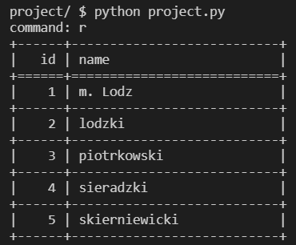

# Road Traffic Category Calculator
#### Video Demo: https://youtu.be/LQNRWJ1VAG0
## Description:
This program is meant for civil engineers and it allows to calculate the road traffic category witch is used for designing construction of road. With use of my program it can be done more convenient and quicker then for example in spreed sheet and it can be also used to quick estimations.

User need to now what average daily traffic is for trucks, trucks with trailers and buses. Lighter vehicle don't take part in selection of substructure and road surface.

All calculatin are based on guidelines and requirements of polish GDDKiA witch is administrator of highways and national/state roads.

## Requirements
* [pytest](https://docs.pytest.org/en/7.2.x/contents.html#) - for testing.
* [tabulat](https://pypi.org/project/tabulate/) - ASCII table generator.


## File Overview
### ----- project.py -----
To use program project.py you need to have csv file with GDP indexs. Default csv file is generated but if you want to extend range of years look at description extractor.py

How to use:

After lunching the application you will be asked for command. If you enter **help** or invalid input the help message like below will show.

```
start or s - start process of computing road traffic category
region or r - show table of regions, id from that table is necessary for calculation
quit or q - quit a program
help or h - help
```
to compute road traffic category you need to know what id of region where your road if. To do that enter **region** and ASCII table will appear whit list of all available regions.



When you start a process by enter **start** you will be guided step by step. All inputs are validated, if you enter invalid input, the error message will appear with explanation how input should look like and you will be asked again to enter proper value. All inputs are based on numbers by typing aa exact value or selecting from list by typing related number.

example of error massage


### ----- test_project.py -----
File with tests for all function from **project.py** except **main()**. For testing you need [pytest](https://docs.pytest.org/en/7.2.x/contents.html#).


### ----- extractor.py -----


It's a helper file used to extract necessary data of GDP growth indexed. Published file with this indexes is PDF table, after copying all from pdf and pasting it to txt file there is 2600 lines of data. Extractor.py sort a data and get rid of unnecessary ones from **DGP growth index - raw copy-paste.csv** and outputs **DGP growth index - clean.csv** and **DGP growth index - clean.json**. In CLI project.py use only .csv file but .json file is prepared for possible future web base application.

extractor.py also allow to extend range of years by multiplying last published year by asking user how many new years he wants to add